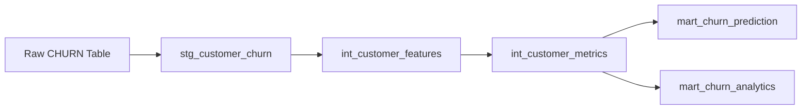

# DBT Telco Churn Prediction Models

This DBT project transforms raw telco customer churn data into ML-ready features for churn prediction.

## Project Structure

```
dbt_churn/
├── models/
│   ├── staging/           # Clean and standardize raw data
│   │   ├── _sources.yml   # Source table definitions
│   │   ├── stg_customer_churn.sql
│   │   └── stg_customer_churn.yml
│   ├── intermediate/      # Feature engineering
│   │   ├── int_customer_features.sql
│   │   ├── int_customer_features.yml
│   │   └── int_customer_metrics.sql
│   └── marts/            # Analytics-ready tables
│       ├── mart_churn_prediction.sql    # ML-ready encoded features
│       ├── mart_churn_prediction.yml
│       └── mart_churn_analytics.sql     # Business analytics
├── tests/                # Data quality tests
│   ├── test_churn_data_quality.sql
│   └── test_financial_consistency.sql
└── dbt_project.yml      # Project configuration
```

## Data Flow



## Models Description

### Staging Layer
- **stg_customer_churn**: Cleans raw data, standardizes column names, handles data types

### Intermediate Layer
- **int_customer_features**: Creates derived features like family status, tenure segments, service bundles
- **int_customer_metrics**: Adds relative metrics, risk indicators, customer value scores

### Marts Layer
- **mart_churn_prediction**: ML-ready dataset with one-hot encoded categorical variables
- **mart_churn_analytics**: Business-friendly tables for analytics and reporting

## Key Features Created

### Demographic Features
- Family status (family_with_dependents, couple_no_dependents, etc.)
- Age segmentation (senior vs non-senior)

### Service Features
- Internet service type encoding (DSL, Fiber, None)
- Add-on service counts
- Streaming service combinations

### Financial Features
- Spending segments (low, medium, high)
- Relative spending metrics
- Customer lifetime value indicators

### Risk Features
- Churn risk indicators based on contract and payment patterns
- Customer value scores
- Tenure-based segmentation

## Running the Models

```bash
# Run all models
dbt run

# Run specific models
dbt run --select stg_customer_churn
dbt run --select marts.mart_churn_prediction

# Run tests
dbt test

# Generate documentation
dbt docs generate
dbt docs serve
```

## Data Quality Tests

The project includes comprehensive data quality tests:

- **Uniqueness**: Customer IDs are unique across all models
- **Referential Integrity**: Row counts match between related models  
- **Value Validation**: Categorical values are within expected ranges
- **Business Logic**: Financial metrics are consistent
- **Encoding Validation**: One-hot encoded features sum correctly

## Integration with Airflow

The DBT models are integrated into the Airflow DAG:

1. **Source Validation** → Validate raw data availability
2. **DBT Transformations** → Run all DBT models (`dbt run`)
3. **DBT Tests** → Validate data quality (`dbt test`)
4. **ML Feature Loading** → Load processed features for ML pipeline
5. **Model Training** → Train ML models on DBT-processed features

## Output Tables

### mart_churn_prediction
ML-ready dataset with:
- 40+ encoded features for machine learning
- Target variable (0/1 for churn)
- Data quality flags
- Feature completeness scores

### mart_churn_analytics  
Business analytics table with:
- Customer segmentation
- Risk categories
- Readable categorical values
- Customer lifetime value estimates