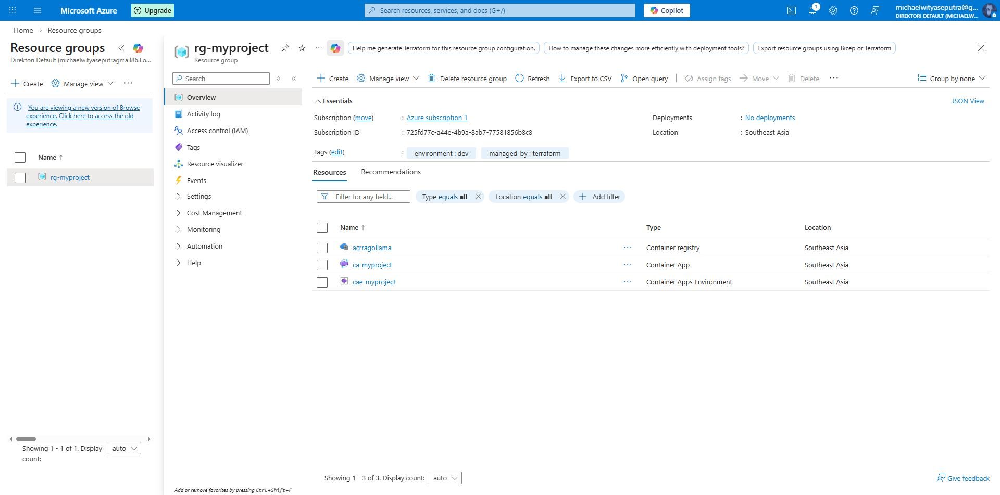
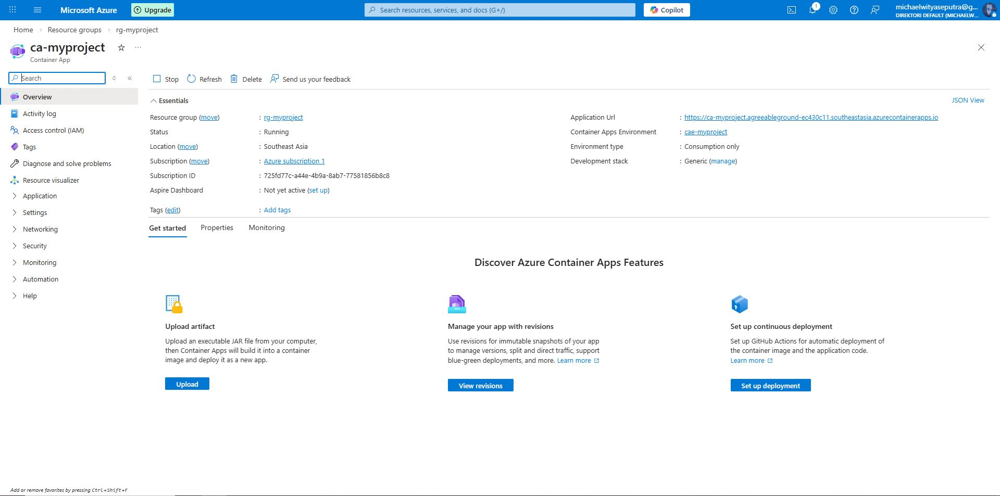
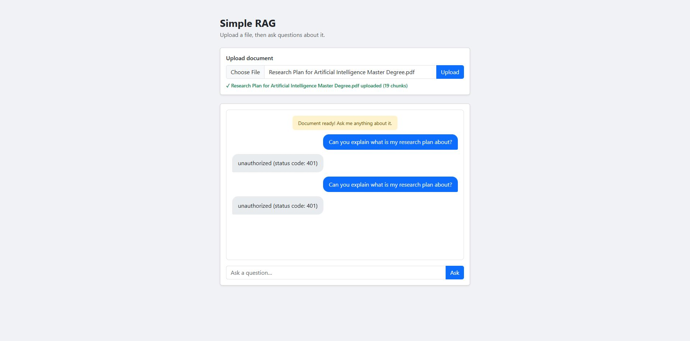
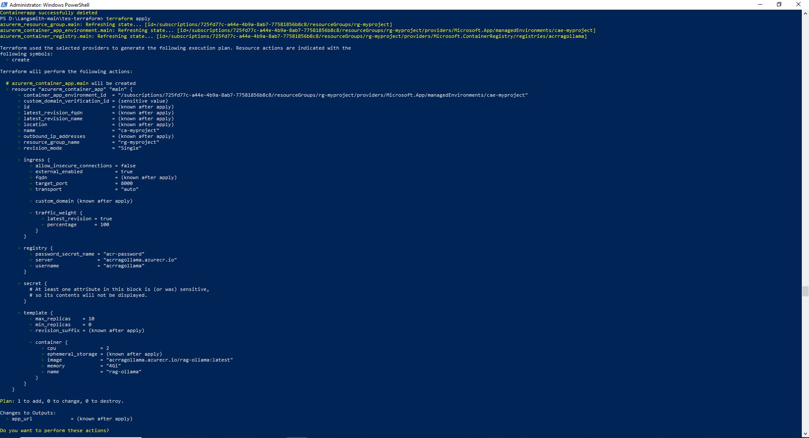

# Terraform RAG Deployment on Azure

A production-ready Infrastructure-as-Code (IaC) project that automates the deployment of a **Retrieval-Augmented Generation (RAG)** application to **Microsoft Azure** using **Terraform**. The application runs a local LLM (via Ollama) inside an Azure Container App, allowing users to upload documents and ask questions about them through a web interface.

---

## Architecture Overview

```
Internet
   │
   ▼
Azure Container Apps  (ca-myproject)
   ├── FastAPI Application  ─── port 8000
   ├── Ollama LLM Service   ─── qwen3.5:cloud
   └── HuggingFace Embeddings (in-memory FAISS)
   │
   ▼
Azure Container Registry  (acrragollama)
   └── Docker image: rag-ollama:latest
   │
   ▼
Resource Group  (rg-myproject)
   └── Region: Southeast Asia
```

| Resource          | Details                                  |
| ----------------- | ---------------------------------------- |
| Cloud Provider    | Microsoft Azure                          |
| Region            | Southeast Asia (`southeastasia`)         |
| Compute           | Azure Container Apps (serverless)        |
| Registry          | Azure Container Registry (Basic SKU)     |
| LLM Runtime       | Ollama (`qwen3.5:cloud` model)           |
| Embedding Model   | `sentence-transformers/all-MiniLM-L6-v2` |
| Vector Store      | FAISS (CPU, in-memory)                   |
| App Framework     | FastAPI (Python 3.12)                    |
| Container CPU     | 2.0 cores                                |
| Container Memory  | 4 Gi                                     |
| Ephemeral Storage | 8 Gi                                     |
| Public Access     | Yes — via Azure Container Apps FQDN      |

---

## Screenshots


## Features

- **Infrastructure as Code** — all Azure resources are defined and managed through Terraform
- **RAG pipeline** — upload PDF or TXT documents and ask natural-language questions against their content
- **Local LLM** — Ollama runs the `qwen3.5:cloud` model inside the container (no external LLM API needed)
- **Web UI** — Bootstrap-based responsive frontend with chat interface and document upload
- **Session management** — each upload gets a unique session ID for isolated context
- **Autoscaling** — Azure Container Apps scales replicas (1–10) based on load
- **Containerised** — Docker image bundles the app, Ollama, and the embedding model for reproducible deploys

---

## Prerequisites

| Tool                                                                       | Minimum Version | Purpose                                |
| -------------------------------------------------------------------------- | --------------- | -------------------------------------- |
| [Terraform](https://developer.hashicorp.com/terraform/downloads)           | v1.3+           | Provision Azure infrastructure         |
| [Azure CLI](https://learn.microsoft.com/en-us/cli/azure/install-azure-cli) | latest          | Authenticate to Azure                  |
| [Docker](https://docs.docker.com/get-docker/)                              | latest          | Build and push container image         |
| Python                                                                     | 3.12            | Run the application locally (optional) |

---

## Project Structure

```
Terraform-RAG-Implementation/
├── main.tf                  # Terraform configuration — all Azure resources
├── .terraform.lock.hcl      # Provider dependency lock file
├── terraform.tfstate         # Terraform state (do not edit manually)
├── main.py                  # FastAPI RAG application
├── Dockerfile               # Container image definition
├── requirements.txt         # Python dependencies
└── static/                  # Documentation screenshots
```

---

## Deployment

### 1. Authenticate to Azure

```bash
az login
az account set --subscription "<your-subscription-id>"
```

### 2. Initialise Terraform

```bash
terraform init
```

### 3. Review the plan

```bash
terraform plan
```

### 4. Provision infrastructure

```bash
terraform apply
```

Terraform will create:

- A Resource Group (`rg-myproject`)
- An Azure Container Registry (`acrragollama`)
- A Container App Environment (`cae-myproject`)
- A Container App (`ca-myproject`)

### 5. Build and push the Docker image

After infrastructure is provisioned, retrieve the ACR login server from Terraform output:

```bash
terraform output acr_login_server
```

Build and push the image:

```bash
# Log in to ACR
az acr login --name acrragollama

# Build the image
docker build -t acrragollama.azurecr.io/rag-ollama:latest .

# Push the image
docker push acrragollama.azurecr.io/rag-ollama:latest
```

### 6. Access the application

```bash
terraform output app_url
```

Open the URL in your browser. The app will be live at the Azure Container Apps FQDN.

---

## Terraform Variables

| Variable       | Default         | Description                                 |
| -------------- | --------------- | ------------------------------------------- |
| `project_name` | `myproject`     | Base name used for all Azure resource names |
| `location`     | `southeastasia` | Azure region for all resources              |

To override defaults, create a `terraform.tfvars` file:

```hcl
project_name = "myapp"
location     = "eastus"
```

---

## Terraform Outputs

| Output                | Description                               |
| --------------------- | ----------------------------------------- |
| `resource_group_name` | Name of the provisioned resource group    |
| `acr_login_server`    | Azure Container Registry login server URL |
| `app_url`             | Public FQDN of the deployed container app |

---

## Application — How It Works

1. **Upload** a PDF or TXT document via the web UI.
2. The document is split into 500-character chunks with 50-character overlap.
3. Each chunk is embedded using `sentence-transformers/all-MiniLM-L6-v2` and stored in a FAISS vector index.
4. **Ask a question** — the app retrieves the 4 most relevant chunks via semantic search.
5. The chunks are passed as context to Ollama (`qwen3.5:cloud`) which generates a grounded answer.
6. The answer is rendered with Markdown formatting in the chat interface.

### API Endpoints

| Method | Path      | Description                                                                                    |
| ------ | --------- | ---------------------------------------------------------------------------------------------- |
| `GET`  | `/`       | Serves the web UI                                                                              |
| `POST` | `/upload` | Upload a document (PDF or TXT). Returns `session_id`, filename, and chunk count.               |
| `POST` | `/ask`    | Submit a question. Body: `{ "session_id": "...", "question": "..." }`. Returns the LLM answer. |

---

## Container Startup Sequence

The Dockerfile start command runs the following steps inside the container:

```bash
ollama serve &           # Start Ollama in background
# wait for Ollama to be ready
ollama pull qwen3.5:cloud  # Download the LLM model
python main.py             # Start FastAPI application
```

The HuggingFace embedding model is pre-downloaded at image build time to minimise cold-start latency.

---

## Teardown

To destroy all provisioned Azure resources:

```bash
terraform destroy
```

---

## Screenshots

| UI                   | Description                       |
| -------------------- | --------------------------------- |
|  | Document upload interface         |
|  | Chat interface                    |
|  | Terraform plan output             |
|  | Azure Portal — deployed resources |
